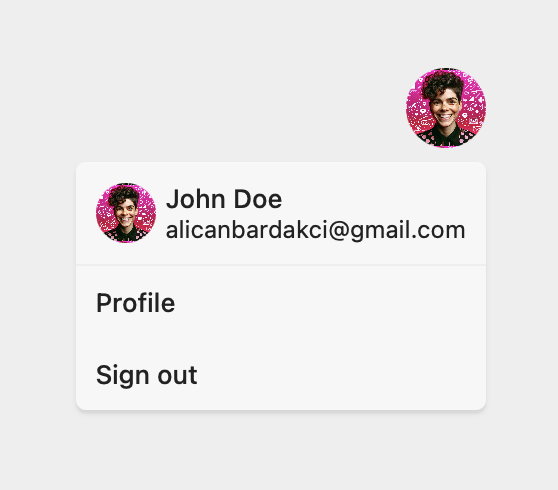

# Using the pre-built Scute UI with React

If you would like to use the pre-built `Scute UI` with your react app, you can do so using the `@scute/ui-react` package. This package would expose the pre-built `Auth` and `Profile` components which you can use to easily integrate Scute to your current app.

Head over to the [example project repo](https://github.com/scuteai/react-scute-ui) to clone and run this example project and check out the [type docs](https://scute-js-docs.netlify.app/) for more `scuteClient` methods.

To get started, install our React SDKs with your favorite package manager:

`npm install @scute/react @scute/ui-react`

Add your [credentials](./01-getting-credentials.md) to your environment variable handler:

```sh
VITE_SCUTE_APP_ID="YOUR_SCUTE_PROJECT_ID"
VITE_SCUTE_BASE_URL="YOUR_SCUTE_BASE_URL"
```

**NOTE**: If you are not using Vite, use "REACT_APP" as your prefix for your environment variables.

### Initialize the Scute client

First initialize the Scute client using the `createClient` method exposed by `@scute/react` package:

```js
// scute.js

import { createClient } from "@scute/react";

export const scute = createClient({
  appId: import.meta.env.VITE_SCUTE_APP_ID,
  baseUrl: import.meta.env.VITE_SCUTE_BASE_URL,
});
```

### Wrap your React app with Scute AuthContextProvider

To be able to use the `useScuteClient` and `useAuth` hooks, wrap your app inside the Scute `AuthContextProvider`:

```jsx
// App.jsx

import { AuthContextProvider } from "@scute/react";
import { scute } from "./scute";

export default function App() {
  return (
    <AuthContextProvider scuteClient={scute}>
      {/* This is where the Prebuilt component and the rest of your application lives */}
    </AuthContextProvider>
  );
}
```

### Add the Scute pre-built UI

First, create a component to show to your authenticated users:

```jsx
// AuthenticatedView.jsx
import { Profile } from "@scute/ui-react";
import { useAuth, useScuteClient } from "@scute/react";

export const AuthenticatedView = () => {
  const { session, user, signOut } = useAuth();
  const scute = useScuteClient();

  if (session.status === "loading") {
    return null;
  } else if (session.status === "unauthenticated") {
    return <>unauthenticated</>;
  }

  return <Profile scuteClient={scute} language="en" />;
};
```

Then, create a component to switch between the authentication form and the `AuthenticatedView` based on the session status:

```jsx
// ScuteUI.jsx
import { Auth } from "@scute/ui-react";
import { useScuteClient, useAuth } from "@scute/react";
import { AuthenticatedView } from "./AuthenticatedView";

export const ScuteUI = () => {
  const { session } = useAuth();
  const scute = useScuteClient();

  if (session.status === "authenticated") {
    return <AuthenticatedView />;
  }

  return (
    <Auth
      scuteClient={scute}
      language="en"
      policyURLs={{
        privacyPolicy: "https://example.com/privacy",
        termsOfService: "https://example.com/terms",
      }}
      logoUrl="https://example.com/logo.png"
    />
  );
};
```

Finally, modify the `App.jsx` to render the `ScuteUI` inside the `AuthContextProvider`:

```jsx
// App.jsx

import { AuthContextProvider } from "@scute/react";
import { scute } from "./scute";
import { ScuteUI } from "./ScuteUI";

export default function App() {
  return (
    <AuthContextProvider scuteClient={scute}>
      <ScuteUI />
    </AuthContextProvider>
  );
}
```

Congrats! You have a working Scute instance now!

**No session**


<br />
<br />
<br />

**With session (Profile)**


<br />
<br />
<br />

**With session (UserButton)**


<br />
<br />
<br />

## Component API's

### `Auth` Component

| Property    | Type                                                               | Default    | Description                                          |
| ----------- | ------------------------------------------------------------------ | ---------- | ---------------------------------------------------- |
| scuteClient | ScuteClient                                                        | undefined  | The Scute client instance. This property is required |
| onSignIn?   | () => void                                                         | undefined  | Callback function for sign-in                        |
| webauthn?   | "strict" &#124; "optional" &#124; "disabled"                       | "optional" | Options for WebAuthn                                 |
| language?   | string                                                             | "en"       | Language setting                                     |
| appearance? | { theme?: [Theme](./03-styling-the-pre-built-ui.md#theme-object) } | undefined  | Appearance settings                                  |
| policyURLs? | { privacyPolicy?: string; termsOfService?: string }                | undefined  | URLs for policy documents                            |
| logoUrl?    | string                                                             | undefined  | URL for the application logo                         |

### `Profile` Component

| Property    | Type                                                               | Default   | Description               |
| ----------- | ------------------------------------------------------------------ | --------- | ------------------------- |
| scuteClient | ScuteClient                                                        | undefined | The Scute client instance |
| language?   | string                                                             | "en"      | Language setting          |
| appearance? | { theme?: [Theme](./03-styling-the-pre-built-ui.md#theme-object) } | undefined | Appearance settings       |

### `UserButton` Component

| Property           | Type                                                               | Default   | Description                |
| ------------------ | ------------------------------------------------------------------ | --------- | -------------------------- |
| scuteClient        | ScuteClient                                                        | undefined | The Scute client instance  |
| language?          | string                                                             | "en"      | Language setting           |
| username?          | string                                                             | undefined | Username to display        |
| profileUrl?        | string                                                             | undefined | Profile URL to navigate to |
| profilePictureUrl? | string                                                             | undefined | Profile picture URL        |
| appearance?        | { theme?: [Theme](./03-styling-the-pre-built-ui.md#theme-object) } | undefined | Appearance settings        |
