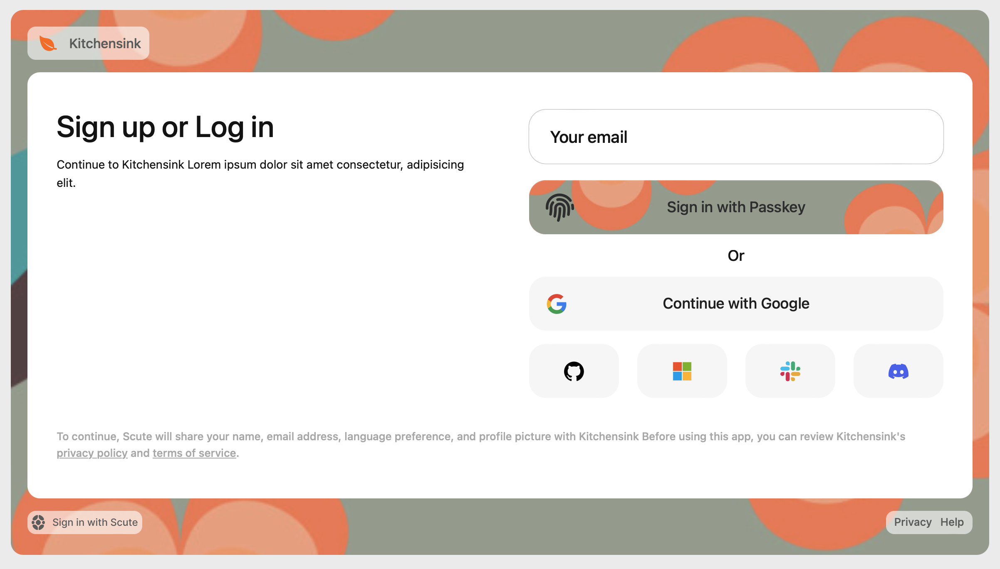

# Styling the pre-built UI

The pre-built UI for React and Vue.js take a property called `appearence`. Using this property, you can change the colors and fonts of the pre-built components to match the rest of your system.

### `Theme` object

The `appearance` property takes an object typed as `{ theme?: [Theme](#theme-object) }` and the [Theme](#theme-object) has two properties: `colors` and `fonts`.

For example, to make the primary button pink and change the font:

```jsx
<Auth
  scuteClient={scuteClient}
  language="en"
  policyURLs={{
    privacyPolicy: "/privacy",
    termsOfService: "/terms",
  }}
  logoUrl={"https://example.com/logo.svg"}
  appearance={{
    theme: {
      colors: { buttonIdleBg: "pink", buttonIdleText: "black" }
      fonts: {
        main: "'SF Pro Display', sans-serif",
        mono: "'SF Mono', monospace",
      }
    }
  }}
/>
```

Below is a list of colors, fonts, and their default values:

**Fonts**

| Property | Default Value                                   |
| -------- | ----------------------------------------------- |
| main     | `"Inter", -apple-system, system-ui, sans-serif` |
| mono     | `monospace`                                     |

**Colors**

| Property                | Default Value             |
| ----------------------- | ------------------------- |
| errorColor              | `#fe4f0d`                 |
| svgIconColor            | `#121212`                 |
| svgIconMutedColor       | `#f7f7f7`                 |
| loadingSpinnerColor     | `#cccccc`                 |
| loadingSpinnerBorder    | `#f1f1f1`                 |
| surfaceBg               | `#f7f7f7`                 |
| surfaceLink             | `#666666`                 |
| surfaceText             | `#666666`                 |
| surfaceTextBg           | `#ffffff`                 |
| cardBg                  | `#ffffff`                 |
| cardHeadingText         | `#121212`                 |
| cardBodyText            | `#121212`                 |
| cardFooterText          | `#b0b0b0`                 |
| cardFooterLink          | `#b0b0b0`                 |
| panelBg                 | `#f7f7f7`                 |
| panelText               | `#121212`                 |
| inputBg                 | `#ffffff`                 |
| inputText               | `#121212`                 |
| inputPlaceholder        | `#333333`                 |
| inputBorder             | `#333333`                 |
| inputFocusGlow          | `rgba(46, 234, 175, 0.3)` |
| inputDisabledBg         | `#dedede`                 |
| inputDisabledText       | `#333333`                 |
| buttonIconColor         | `#ffffff`                 |
| buttonIdleText          | `#ffffff`                 |
| buttonIdleBg            | `#212121`                 |
| buttonIdleBorder        | `transparent`             |
| buttonIdleShadow        | `transparent`             |
| buttonPassiveBg         | `#f7f7f7`                 |
| buttonPassiveText       | `#bababa`                 |
| buttonHoverBg           | `#121212`                 |
| buttonHoverText         | `#ffffff`                 |
| buttonHoverBorder       | `black`                   |
| buttonHoverShadow       | `transparent`             |
| buttonFocusBorder       | `rgba(46, 234, 175, 0.3)` |
| buttonFocusShadow       | `rgba(46, 234, 175, 0.3)` |
| buttonAltIconColor      | `#ffffff`                 |
| buttonAltIdleText       | `#333333`                 |
| buttonAltIdleBg         | `#ffffff`                 |
| buttonAltIdleBorder     | `rgba(0,0,0,0.2)`         |
| buttonAltIdleShadow     | `rgba(0,0,0,0.05)`        |
| buttonAltPassiveBg      | `#757575`                 |
| buttonAltHoverBg        | `#121212`                 |
| buttonAltHoverText      | `#ffffff`                 |
| buttonAltHoverBorder    | `rgba(0,0,0,0.05)`        |
| buttonAltHoverShadow    | `rgba(0,0,0,0.05)`        |
| buttonAltFocusBorder    | `rgba(46, 234, 175, 0.3)` |
| buttonAltFocusShadow    | `rgba(46, 234, 175, 0.3)` |
| buttonSocialIconColor   | `#ffffff`                 |
| buttonSocialIdleText    | `#222222`                 |
| buttonSocialIdleBg      | `#f7f7f7`                 |
| buttonSocialIdleBorder  | `transparent`             |
| buttonSocialIdleShadow  | `transparent`             |
| buttonSocialPassiveBg   | `#757575`                 |
| buttonSocialHoverBg     | `#f7f7f7`                 |
| buttonSocialHoverText   | `#222222`                 |
| buttonSocialHoverBorder | `transparent`             |
| buttonSocialHoverShadow | `transparent`             |
| buttonSocialFocusBorder | `rgba(46, 234, 175, 0.3)` |
| buttonSocialFocusShadow | `rgba(46, 234, 175, 0.3)` |
| userAvatarBg            | `#f7f7f7`                 |
| userAvatarBorder        | `transparent`             |
| userAvatarText          | `#222222`                 |
| userMenuBg              | `#f7f7f7`                 |
| userMenuText            | `#222222`                 |
| userMenuSeparator       | `#eee`                    |
| userMenuHoverBg         | `#f1f1f1`                 |
| userMenuHoverText       | `#222222`                 |
| userMenuShadow          | `rgba(0,0,0,0.05)`        |

### Examples

You can get really creative with the colors:


<br />
<br />

```jsx
<Auth
  scuteClient={scuteClient}
  language="en"
  policyURLs={{
    privacyPolicy: "/privacy",
    termsOfService: "/terms",
  }}
  logoUrl={"https://example.com/logo.svg"}
  appearance={{
    theme: {
      colors: {
        svgIconColor: "#2BEB9A",
        surfaceBg: "#2BEB9A",
        surfaceLink: "#222222",
        surfaceText: "#222222",
        surfaceTextBg: "transparent",
        cardBg: "#1f1f1f",
        cardHeadingText: "#ffffff",
        cardBodyText: "#ffffff",
        hiContrast: "#ffffff",
        panelBg: "#fff",
        panelText: "#000000",
        inputBg: "#ffffff",
        inputText: "#121212",
        inputPlaceholder: "#333333",
        inputBorder: "#333333",
        inputFocusGlow: "rgba(46, 234, 175, 0.3)",
        buttonIconColor: "#ffffff",
        buttonIdleText: "#222222",
        buttonIdleBg: "#2BEB9A",
        buttonIdleBorder: "transparent",
        buttonIdleShadow: "transparent",
        buttonPassiveBg: "#f7f7f7",
        buttonPassiveText: "#bababa",
        buttonHoverBg: "#2BEB9A",
        buttonHoverText: "white",
        buttonHoverBorder: "black",
        buttonHoverShadow: "transparent",
        buttonFocusBorder: "rgba(46, 234, 175, 0.3)",
        buttonFocusShadow: "rgba(46, 234, 175, 0.3)",
        buttonAltIconColor: "#ffffff",
        buttonAltIdleText: "#333333",
        buttonAltIdleBg: "white",
        buttonAltIdleBorder: "rgba(0,0,0,0.2)",
        buttonAltIdleShadow: "rgba(0,0,0,0.05)",
        buttonAltPassiveBg: "#757575",
        buttonAltHoverBg: "#2BEB9A",
        buttonAltHoverText: "#121212",
        buttonAltHoverBorder: "rgba(0,0,0,0.05)",
        buttonAltHoverShadow: "rgba(0,0,0,0.05)",
        buttonAltFocusBorder: "rgba(46, 234, 175, 0.3)",
        buttonAltFocusShadow: "rgba(46, 234, 175, 0.3)",
        buttonSocialIconColor: "#ffffff",
        buttonSocialIdleText: "#fff",
        buttonSocialIdleBg: "#3F3F3F",
        buttonSocialIdleBorder: "transparent",
        buttonSocialIdleShadow: "transparent",
        buttonSocialPassiveBg: "#757575",
        buttonSocialHoverBg: "#3F3F3F",
        buttonSocialHoverText: "#fff",
        buttonSocialHoverBorder: "transparent",
        buttonSocialHoverShadow: "transparent",
        buttonSocialFocusBorder: "rgba(46, 234, 175, 0.3)",
        buttonSocialFocusShadow: "rgba(46, 234, 175, 0.3)",
      },
    },
  }}
/>
```

You can even add background images to Buttons, the Surface section and the Card section


<br />
<br />

```jsx
<Auth
  scuteClient={scuteClient}
  language="en"
  policyURLs={{
    privacyPolicy: "/privacy",
    termsOfService: "/terms",
  }}
  logoUrl={"https://example.com/logo.svg"}
  appearance={{
    theme: {
      colors: {
        svgIconColor: "#F17F5B",
        surfaceBg: "url('/images/bg.png')",
        surfaceTextBg: "rgba(255, 255, 255, 0.6)",
        buttonIdleText: "#333333",
        buttonIdleBg: "#F17F5B url('/images/bg.png')",
        buttonHoverText: "#333333",
        buttonHoverBg: "#F17F5B",
        buttonAltHoverText: "#333333",
        buttonAltHoverBg: "#F17F5B",

        buttonFocusBorder: "rgba(255,117,193, 0.7)",
        buttonFocusShadow: "rgba(255,117,193, 0.7)",
        buttonAltFocusBorder: "rgba(255,117,193, 0.7)",
        buttonAltFocusShadow: "rgba(255,117,193, 0.7)",
        inputFocusGlow: "rgba(255,117,193, 0.7)",
      },
    },
  }}
/>
```

### Responsiveness

The Scute UI has the ability to adapt it's design based on its container size.

With a container size smaller than 1000px, Scute UI will change into a single column style for ease of use in devices with smaller screen:


<br /><br />

If the container size is bigger than 1000px, Scute UI will switch to a two column layuout to make better use of the larger screen to provide a finer experience:


