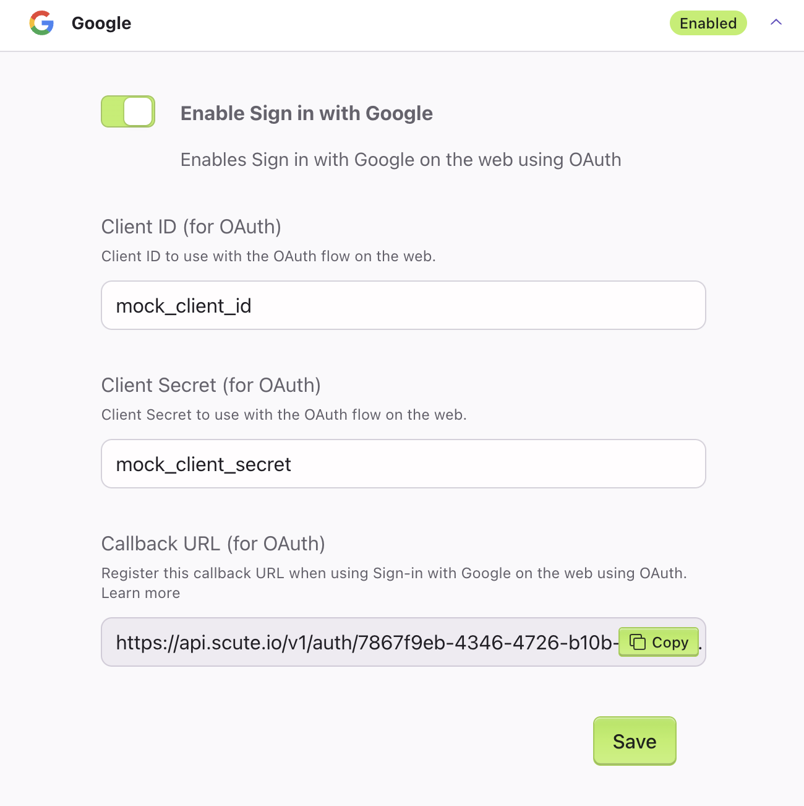
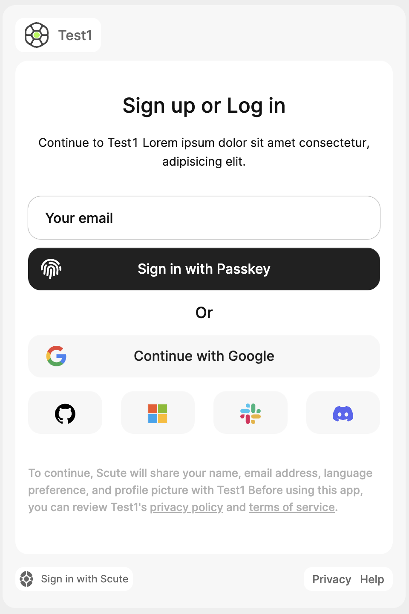

# OAuth

The JavaScript SDK provides a pre-built UI for OAuth flows, as well as methods to start and authenticate OAuth flows that you can connect to your own UI. Use either of these approaches to quickly get up and running with OAuth.

### Configuration

To configure OAuth, sign in to [control.scute.io](https://control.scute.io), and select your app. From the menu on the left hand side, click on Auth Providers, then select the provider you want to configure and enable it. Enter your `Client ID` and `Client Secret` from your provider and copy the `Callback URL` and paste it to the appropriate area for your oAuth provider’s configuration.


<br /><br />

### OAuth with Pre-built Scute UI

If you are using the pre-built Scute UI, the component will recognize the oAuth configuration and automatically display the buttons for the configured providers:

<br /><br />

### Using the JS Core SDK to integrate into your own UI

JS Core SDK provides the oAuth configuration and methods to start and oAuth flows that you can connect to your own UI.

#### Getting the oAuth configuration:

Your `appData` has a property called `oauth_providers` which is an array of configured oAuth providers that are [enabled and configured](#configuration) from [control.scute.io](https://control.scute.io).

You can access your app data using the `scuteClient.getAppData` method:

```jsx
// ... Redacted

await {data: appData, error}scuteClient.getAppData();

console.log(appData.oauth_providers);

// [
//     {
//         "id": "google",
//         "provider": "google",
//         "name": "Google",
//         "icon": "provider-icons/google-icon.svg"
//     }
// ]

```

This will return an array of objects with the following properties:

| Property       | Type   | Description                 |
| -------------- | ------ | --------------------------- |
| id \| provider | string | The provider ID             |
| name           | string | The provider name           |
| icon           | string | A URL for the provider icon |

Using this property you can render the oAuth buttons in your UI:

```jsx
// ... Redacted
const [oauthProviders, setOauthProviders] = useState([]);

useEffect(() => {
  const getAppData = async () => {
    const { data, error } = await scuteClient.getAppData();
    if (error) {
      console.error(error);
      return;
    }

    setOauthProviders(data.oauth_providers || []);
  };

  getAppData();
}, []);

return (
  <div>
    {oauthProviders.map((provider) => (
      <button
        key={provider.id}
        onClick={() => scuteClient.signInWithOAuth(provider.id)}
      >
        
        {provider.name}
      </button>
    ))}
  </div>
);
// ... Redacted
```

#### Starting the oAuth flow with `signInWithOAuth` method:

To start the oAuth flow, you can use the `signInWithOAuth` method of the scute client. This method takes the `provider` ID as an argument and will redirect the user to the oAuth provider's login page:

```jsx
<button key={provider.id} onClick={() => scuteClient.signInWithOAuth("google")}>
  Sign in with Google
</button>
```

Your provider and scute api will handle the rest of the flow and redirect the user back to your app with a magic link. Using the scute client verify the magic link as usual and log the user in based on the response:

```jsx
const magicLinkToken = scuteClient.getMagicLinkToken();
const { data: tokenPayloads, error } = await scuteClient.verifyMagicLinkToken(
  magicLinkToken
);

if (error) {
  console.error(error);
  return;
}

await scuteClient.signInWithTokenPayload(tokenPayloads.authPayload);
```
