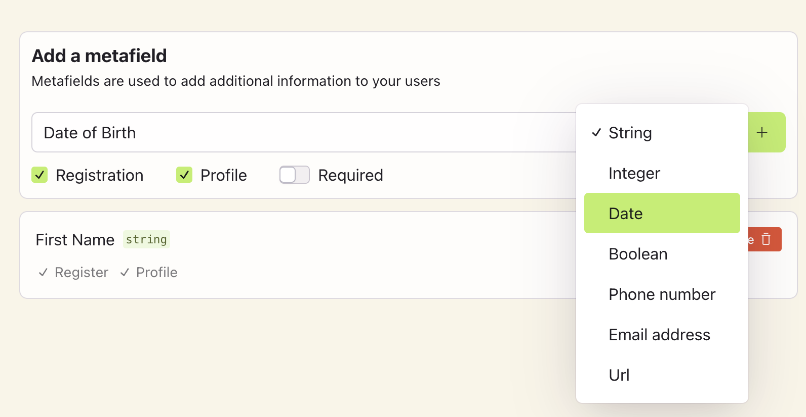

# Creating and Managing Metafields

Metafields are custom fields that you can use to add extra information to your sign up form. You can use metafields to add information like first name, date of birth, phone number. Scute supports 7 data types for metafields: string, integer, date, email, phone, url, and boolean.

You can make the metafield required or optional. If you make the metafield required, the user must fill in the metafield to sign up. If you make the metafield optional, the user can choose whether to fill in the metafield.

You can also set the metafield to up to show up on registration screen using the checkbox "Registration". You can also choose whether the metafield should be editable from the Profile component of Scute UI.

 
 

